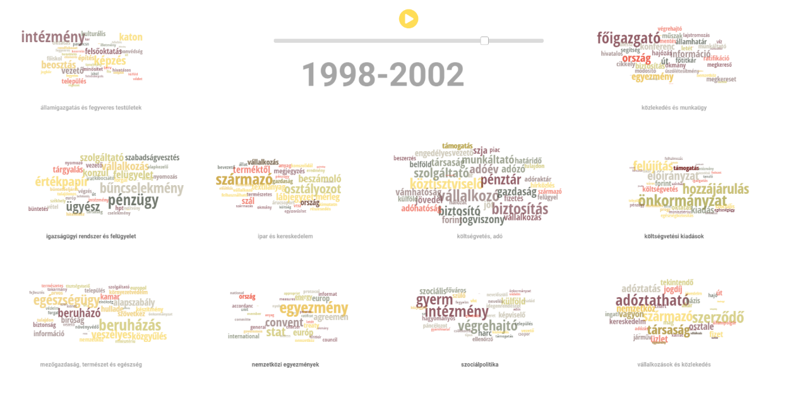

# Felügyelet nélküli tanulás {#lda_ch}

```{r include=FALSE}

source("_common.R")

```

## K-közép klaszterezés

A klaszterezés egy adathalmaz pontjainak, rekordjainak hasonlóság alapján való csoportosítása, ami szinte minden nagyméretű adathalmaz leíró modellezésére alkalmas. A klaszterezés során az adatpontokat diszjunkt halmazokba, azaz klaszterekbe soroljuk, hogy az elemeknek egy olyan partíciója jöjjön létre, amelyben a közös csoportokba kerülő elempárok lényegesen jobban hasonlítanak egymáshoz, mint azok a pontpárok, melyek két különböző csoportba sorolódtak. Klaszterezés során a megfelelő csoportok kialakítása nem egyértelmű feladat, mivel a különböző adatok eltérő jelentése és felhasználása miatt adathalmazonként más szempontokat kell figyelembe vennünk. Egy klaszterezési feladat megoldásához ismernünk kell a különböző algoritmusok alapvető tulajdonságait és mindig szükség van az eredményként kapott klaszterezés kiértékelésére. Mivel egy klaszterezés az adatpontok hasonlóságából indul ki, ezért az eljárás során az első fontos lépés az adatpontok páronkénti hasonlóságát a lehető legjobban megragadó hasonlósági függvény kiválasztása [@tanBevezetesAzAdatbanyaszatba2011]. Számos klaszterezési eljárás létezik, melyek között az egyik leggyakoribb különbségtétel, hogy a klaszterek egymásba ágyazottak vagy sem. Ez alapján beszélhetünk hierarchikus és felosztó klaszterezésről.

A hierarchikus klaszterezés egymásba ágyazott klaszterek egy fába rendezett halmaza, azaz ahol a klaszterek alklaszterekkel rendelkeznek. A fa minden csúcsa (klasztere), a levélcsúcsokat kivéve, a gyermekei (alklaszterei) uniója, és a fa gyökere az összes objektumot tartalmazó klaszter. Felosztó (*partitional*) klaszterezés esetén az adathalmazt olyan, nem átfedő alcsoportokra bontjuk, ahol minden adatobjektum pontosan egy részhalmazba kerül [@tanBevezetesAzAdatbanyaszatba2011; @tikkSzovegbanyaszat2007]. A klaszterezési eljárások között aszerint is különbséget tehetünk, hogy azok egy objektumot csak egy vagy több klaszterbe is beilleszthetnek. Ez alapján beszélhetünk kizáró (*exclusive*), illetve nem-kizáró (*non exclusive*), vagy átfedő (*overlapping*) klaszterezésről. Az előbbi minden objektumot csak egyetlen klaszterhez rendel hozzá, az utóbbi esetén egy pont több klaszterbe is beleillik. Fuzzy klaszterezés esetén minden objektum minden klaszterbe beletartozik egy tagsági súly erejéig, melynek értéke 0 (egyáltalán nem tartozik bele) és 1 (teljesen beletartozik) közé esik. A klasztereknek is különböző típusai vannak, így beszélhetünk prototípus-alapú, gráf-alapú vagy sűrűség-alapú klaszterekről.

A prototípus-alapú klaszter olyan objektumokat tartalmazó halmaz, amelynek mindegyik objektuma jobban hasonlít a klasztert definiáló objektumhoz, mint bármelyik másik klasztert definiáló objektumhoz. A prototípus-alapú klaszterek közül a K-közép klaszter az egyik leggyakrabban alkalmazott. A K-közép klaszterezési módszer első lépése *k* darab kezdő középpont kijelölése, ahol *k* a klaszterek kívánt számával egyenlő. Ezután minden adatpontot a hozzá legközelebb eső középponthoz rendelünk. Az így képzett csoportok lesznek a kiinduló klaszterek. Ezután újra meghatározzuk mindegyik klaszter középpontját a klaszterhez rendelt pontok alapján. A hozzárendelési és frissítési lépéseket felváltva folytatjuk addig, amíg egyetlen pont sem vált klasztert, vagy ameddig a középpontok ugyanazok nem maradnak [@tanBevezetesAzAdatbanyaszatba2011].

A K-közép klaszterezés tehát a dokumentumokat alkotó szavak alapján keresi meg a felhasználó által megadott számú (*k*) klasztert, amelyeket a középpontjaik képviselnek, és így rendezi a dokumentumokat csoportokba. A klaszterezés vagy csoportosítás egy induktív kategorizálás, ami akkor hasznos, amikor nem állnak a kutató rendelkezésére előzetesen ismert csoportok, amelyek szerint a vizsgált dokumentumokat rendezni tudná. Hiszen ebben az esetben a korpusz elemeinek rendezéséhez nem határozunk meg előzetesen csoportokat, hanem az eljárás során olyan különálló csoportokat hozunk létre a dokumentumokból, amelynek tagjai valamilyen szempontból hasonlítanak egymásra. A csoportosítás legfőbb célja az, hogy az egy csoportba kerülő szövegek minél inkább hasonlítsanak egymásra, miközben a különböző csoportba kerülők minél inkább eltérjenek egymástól. Azaz klaszterezésnél nem egy-egy szöveg jellemzőire vagyunk kíváncsiak, hanem arra, hogy a szövegek egy-egy csoportja milyen hasonlóságokkal bír [@tikkSzovegbanyaszat2007; @burtejinCsoportositasKlaszterezes2016]. A gépi kódolással végzett klaszterezés egy felügyelet nélküli tanulás, mely a szöveg tulajdonságaiból tanul, anélkül, hogy előre meghatározott csoportokat ismerne. Alkalmazása során a dokumentum tulajdonságait és a modell becsléseit felhasználva jönnek létre a különböző kategóriák, melyekhez később hozzárendeli a szöveget [@grimmer2013text]. Az osztályozással ellentétben a csoportosítás esetén tehát nincs ismert „címkékkel" ellátott kategóriarendszer vagy olyan minta, mint az osztályozás esetében a tanítókörnyezet, amiből tanulva a modellt fel lehet építeni [@tikkSzovegbanyaszat2007]. A gépi kódolással végzett csoportosítás (klaszterezés) esetén a kutató feladata a megfelelő csoportosító mechanizmus kiválasztása, mely alapján egy program végzi el a szövegek különböző kategóriákba sorolását. Ezt követi a hasonló szövegeket tömörítő csoportok elnevezésének lépése. A több dokumentumból álló korpuszok esetében a gépi klaszterelemzés különösen eredményes és költséghatékony lehet, mivel egy nagy korpusz vizsgálata sok erőforrást igényel [@grimmer2013text, pp. 1.].

A klaszterezés bemutatásához a rendszerváltás utáni magyar miniszterelnökök egy-egy véletlenszerűen kiválasztott beszédét használjuk.

```{r}
library(readr)
library(dplyr)
library(purrr)
library(stringr)
library(readtext)
library(quanteda)
library(quanteda.textstats)
library(tidytext)
library(ggplot2)
library(topicmodels)
library(factoextra)
library(stm)
library(igraph)
library(HunMineR)
```

A beszédek szövege meglehetősen tiszta, ezért az egyszerűség kedvéért most kihagyjuk a szövegtisztítás lépéseit. Az elemzés első lépéseként a `.csv` fájlból beolvasott szövegeinkből a `quanteda` csomaggal korpuszt hozunk létre, majd abból egy dokumentum-kifejezés mátrixot készítünk a `dfm()` függvénnyel. Láthatjuk, hogy márixunk 7 megfigyelést és 4 változót tartalmaz.

```{r}
beszedek <- HunMineR::data_miniszterelnokok

beszedek_corpus <- corpus(beszedek)

beszedek_dfm <- beszedek_corpus %>% 
  tokens() %>% 
  dfm()
```

A beszédek klaszterekbe rendezését az R egyik alapfüggvénye, a `kmeans` végzi. Első lépésben 3 klasztert készítünk. A `table()` függvénnyel megnézhetjük, hogy egy-egy csoportba hány dokumentum került.

```{r}
beszedek_klaszter <- kmeans(beszedek_dfm, centers = 2)

table(beszedek_klaszter$cluster)
```

A felügyelet nélküli klasszifikáció nagy kérdése, hány klasztert alakítsunk ki, hogy megközelítsük a valóságot, és ne csak mesterségesen kreáljunk csoportokat. Ez ugyanis azzal a kockázattal jár, hogy ténylegesen nem létező csoportok is létrejönnek. A klaszterek optimális számának meghatározására kvalitatív és kvantitatív lehetőségeink is vannak. A következőkben az utóbbira mutatunk példát, amihez a `factoextra` csomagot használjuk A lenti ábra azt mutatja, hogy a klasztereken belüli négyzetösszegek hogyan változnak a *k* paraméter változásának függvényében. Minél kisebb a klasztereken belüli négyzetösszegek értéke, annál közelebbi pontok tartoznak össze, így a kisebb értékekkel definiált klasztereket kapunk. Az ábra alapján tehát az ideális *k* 4 vagy 2, attól fuggően, hogy milyen feltevésekkel élünk a kutatásunk során. A 2-es érték azért lehet jó, mert a $k > 2$ értékek esetén a négyzetösszegek értéke nem csökken drasztikusan és a korpuszunk alapján a két („jobb-bal") klaszter kvalitativ alapon is jól definiálható. A $k = 4$ pedig azért lehet jó, mert utánna gyakorlatilag nem változik a kapott négyzetösszeg, ami azt jelzi, hogy a további klaszterek hozzáadásával nem lesz pontosabb a csoportosítás.

```{r, fig.cap="Optimális klaszterek száma"}
factoextra::fviz_nbclust(as.matrix(beszedek_dfm), kmeans, method = "wss", k.max = 5, linecolor = "black") +
labs(
  title = NULL,
  x = "Klaszterek száma",
  y = "Klasztereken belüli négyzetösszeg")
```

A kialakított csoportokat vizuálisan is megjeleníthetjük.

```{r, fig.cap="A miniszterelnöki beszédek klaszterei"}
factoextra::fviz_cluster(
  beszedek_klaszter, 
  data = beszedek_dfm, 
  pointsize = 2,
  repel = TRUE,
  ggtheme = theme_minimal()
  ) +
  labs(
    title = "",
    x = "Első dimenzió",
    y = "Második dimenzió"
  ) +
  theme(legend.position = "none")
```

## LDA topik modellek[^lda1]

[^lda1]: A kód részben az alábbiakon alapul: tidytextmining.com/topicmodeling.html. Az általunk is használt `topicmodels` csomag interfészt biztosít az LDA modellek és a korrelált témamodellek (CTM) C kódjához, valamint az LDA modellek illesztéséhez szükséges C ++ kódhoz.

A topik modellezés a dokumentumok téma klasztereinek meghatározására szolgáló valószínűség alapú eljárás, amely szógyakoriságot állapít meg minden témához, és minden dokumentumhoz hozzárendeli az adott témák valószínűségét. A topik modellezés egy felügyelet nélküli tanulási módszer, amely során az alkalmazott algoritmus a dokumentum tulajdonságait és a modell becsléseit felhasználva hoz létre különböző kategóriákat, melyekhez később hozzárendeli a szöveget [@tikkSzovegbanyaszat2007; @grimmer2013text; @burtejinCsoportositasKlaszterezes2016]. Az egyik leggyakrabban alkalmazott topik modellezési eljárás, a Látens Dirichlet Allokáció (LDA) alapja az a feltételezés, hogy minden korpusz topikok/témák keverékéből áll, ezen témák pedig statisztikailag a korpusz szókészlete valószínűségi függvényeinek (eloszlásának) tekinthetőek [@bleiLatentDirichletAllocation2003]. Az LDA a korpusz dokumentumainak csoportosítása során az egyes dokumentumokhoz topik szavakat rendel, a topikok megbecsléséhez pedig a szavak együttes megjelenését vizsgálja a dokumentum egészében. Az LDA algoritmusnak előzetesen meg kell adni a keresett klaszterek (azaz a keresett topikok) számát, ezt követően a dokumentumhalmazban szereplő szavak eloszlása alapján az algoritmus azonosítja a kulcsszavakat, amelyek eloszlása kirajzolja a topikokat [@bleiLatentDirichletAllocation2003; @burtejinCsoportositasKlaszterezes2016; @jacobiQuantitativeAnalysisLarge2016].

```{r echo=FALSE}

```

A következőkben a magyar törvények korpuszán szemléltetjük a topik modellezés módszerét, hogy a mesterséges intelligencia segítségével feltárjuk a korpuszon belüli rejtett összefüggéseket. A korábban leírtak szerint tehát nincsenek előre meghatározott kategóriáink, dokumentumainkat a klaszterezés segítségével szeretnénk csoportosítani. Egy-egy dokumentumban keveredhetnek a témák és az azokat reprezentáló szavak. Mivel ugyanaz a szó több topikhoz is kapcsolódhat, így az eljárás komplex elemzési lehetőséget nyújt, az egy szövegen belüli témák és akár azok dokumentumon belüli súlyának azonosítására. Példánkban csak a korpusz egy részén szemléltetjük a topik modellezést, a teljes korpusz és az annak elemzéséhez szükséges kód elérhető az alábbi GitHub linken: <https://github.com/poltextlab>.

Az alábbiakban a 1998--2002-es és a 2002--2006-os parlamenti ciklus 1032 törvényszövegének topik modellezését és a szükséges előkészítő, korpusztisztító lépéseket mutatjuk be. A fájlokat töltsük be az R által használt munkakönyvtárba.[^lda2]

[^lda2]: A törvényeket és a metaadatokat tartalmazó adatbázisokat regisztációt követően a Hungarian Comparative Agendas Projekt honlapjáról <https://cap.tk.hu/> lehet letölteni.

Töltsük be az elemezni kívánt csv fájlt, megadva az elérési útvonalát.

```{r warning=FALSE, message=FALSE}
torvenyek <- HunMineR::data_lawtext_1998_2006
```

Az előző fejezetekben láthattuk, hogyan lehet használni a `stringr` csomagot a szövegtisztításra. A lépések a már megismert sztenderd folyamatot követik: számok, központozás, sortörések, extra szóközök eltávolítása, illetve a szöveg kisbetűsítése. Az eddigieket további szövegtisztító lépésekkel is kiegészíthetjük. Olyan elemek esetében, amelyek nem feltétlenül különálló szavak és el akarjuk távolítani őket a korpuszból, szintén a `str_remove_all()` a legegyszerűbb megoldás.

```{r}
torvenyek_tiszta <- torvenyek %>%
  mutate(
    text = str_remove_all(string = text, pattern = "[:cntrl:]"),
    text = str_remove_all(string = text, pattern = "[:punct:]"),
    text = str_remove_all(string = text, pattern = "[:digit:]"),
    text = str_to_lower(text),
    text = str_trim(text),
    text = str_squish(text),
    text = str_remove_all(string = text, pattern = "’"),
    text = str_remove_all(string = text, pattern = "…"),
    text = str_remove_all(string = text, pattern = "–"),
    text = str_remove_all(string = text, pattern = "“"),
    text = str_remove_all(string = text, pattern = "”"),
    text = str_remove_all(string = text, pattern = "„"),
    text = str_remove_all(string = text, pattern = "«"),
    text = str_remove_all(string = text, pattern = "»"),
    text = str_remove_all(string = text, pattern = "§"),
    text = str_remove_all(string = text, pattern = "°"),
    text = str_remove_all(string = text, pattern = "<U+25A1>"),
    text = str_remove_all(string = text, pattern = "@")
  )
```

A dokumentum változókat egy külön fájlból adjuk hozzá, ami a törvények keletkezési évét tartalmazza, illetve azt, hogy melyik kormányzati ciklusban születtek. Mindkét adatbázisban egy közös egyedi azonosító jelöli az egyes törvényeket, így ki tudjuk használni a `dplyr` `left_join()` függvényét, ami hatékonyan és gyorsan kapcsol össze adatbázisokat közös egyedi azonosító mentén. Jelen esetben ez az egyedi azonosító a `txt_filename` oszlopból fog elkészülni, amely a törvények neveit tartalmazza. Első lépésben betöltjük a metaadatokat tartalmazó adattáblát, majd a `.txt` rész előtti törvényneveket tartjuk csak meg a létrehozott `doc_id`- oszlopban. A `[^\\.]*` regular expression itt a string elejétől indulva kijelöl mindent az elso `.` karakterig. A `str_extract()` pedig ezt a kijelölt string szakaszt (ami a törvények neve) menti át az új változónkba.

```{r}
torveny_meta <- HunMineR::data_lawtext_meta

torveny_meta <- torveny_meta %>%
  mutate(doc_id = str_extract(txt_filename, "[^\\.]*")) %>%
  select(-txt_filename)

head(torveny_meta, 5)
```

Végül összefűzzük a dokumentumokat és a metaadatokat tartalmazó data frame-eket.

```{r}
torveny_final <- dplyr::left_join(torvenyek_tiszta, torveny_meta, by = "doc_id")
```

Majd létrehozzuk a korpuszt és ellenőrizzük azt.

```{r}
torvenyek_corpus <- corpus(torveny_final)

head(summary(torvenyek_corpus), 5)
```

Az RStudio environments fülén láthatjuk, hogy egy `r length(torvenyek_corpus)` elemből álló korpusz jött létre, amelynek tartalmát a `summary()` paranccsal kiíratva, a console ablakban megjelenik a dokumentumok listája és a főbb leíró statisztikai adatok (egyedi szavak -- *types*; szószám -- *tokens*; mondatok -- *sentences*). Az előbbi fejezettől eltérően most a tokenizálás során is végzünk még egy kis tisztítást: a felesleges stop szavakat kitöröljük a `tokens_remove()` és `stopwords()` kombinálásával. A `quanteda` tartalmaz egy beépített magyar stopszó szótárat. A második lépésben szótövesítjük a tokeneket a `tokens_words()` használatával, ami szintén képes a magyar nyelvű szövegeket kezelni.

Szükség esetén a beépített magyar nyelvű stopszó szótárat saját stopszavakkal is kiegészíthetjük. Példaként a `HunMineR` csomagban lévő kiegészítő stopszó data frame-t töltsük be.

```{r}
custom_stopwords <- HunMineR::data_legal_stopwords
```

Mivel a korpusz ellenőrzése során találunk még olyan kifejezéseket, amelyeket el szeretnénk távolítani, ezeket is kiszűrjük.

```{r}
custom_stopwords_egyeb <- c("lábjegyzet", "országgyűlés", "ülésnap")
```

Aztán pedig a korábban már megismert *pipe operáror* használatával elkészítjük a token objektumunkat. A szótövesített tokeneket egy külön objektumban tároljuk, mert gyakran előfordul, hogy később vissza kell térnünk az eredeti token objektumhoz, hogy egyéb műveleteket végezzünk el, például további stopszavakat távolítsunk el.

```{r}
torvenyek_tokens <- tokens(torvenyek_corpus) %>%
  tokens_remove(stopwords("hungarian")) %>%
  tokens_remove(custom_stopwords) %>%
  tokens_remove(custom_stopwords_egyeb) %>%
  tokens_wordstem(language = "hun")
```

Végül eltávolítjuk a dokumentum-kifejezés mátrixból a túl gyakori kifejezéseket. A `dfm_trim()` függvénnyel a nagyon ritka és nagyon gyakori szavak megjelenését kontrollálhatjuk. Ha `termfreq_type` opció értéke "prop" (úgymint *proportional*) akkor 0 és 1.0 közötti értéket vehetnek fel a `max_termfreq/docfreq` és `min_termfreq/docfreq` paraméterek. A lenti példában azokat a tokeneket tartjuk meg, amelyek legalább egyszer előfordulnak ezer dokumentumonként (így kizárva a nagyon ritka kifejezéseket).

```{r}
torvenyek_dfm <- dfm(torvenyek_tokens) %>%
  quanteda::dfm_trim(min_termfreq = 0.001, termfreq_type = "prop")
```

A szövegtisztító lépesek eredményét úgy ellenőrizhetjük, hogy a 2. fejezetben bemutatottak szerint szógyakorisági listát készítünk a korpuszban maradt kifejezésekről. Itt kihasználhatjuk a korpuszunkban lévő metaadatokat és megnézhetjük ciklus szerinti bontásban a szófrekvencia ábrát. Az ábránál figyeljünk arra, hogy a tidytext `reorder_within` függvényét használjuk, ami egy nagyon hasznos megoldás a csoportosított sorrendbe rendezésre a `ggplot2` ábránál.

```{r tidy = TRUE, tidy.opts=list(width.cutoff=80), fig.cap="A 15 leggyakoribb token a korpuszban"}
top_tokens <- textstat_frequency(
  torvenyek_dfm, 
  n = 15, 
  groups = docvars(torvenyek_dfm, field = "electoral_cycle")
  )

ggplot(top_tokens, aes(reorder_within(feature, frequency, group), frequency)) +
  geom_point(aes(shape = group), size = 2) +
  coord_flip() +
  labs(
    x = NULL,
    y = "szófrekvencia"
  ) +
  facet_wrap(~group, nrow = 2, scales = "free") +
  tidytext::scale_x_reordered() +
  theme(legend.position = "none")
```

A szövegtisztító lépéseket később újabbakkal is kiegészíthetjük, ha észrevesszük, hogy az elemzést zavaró tisztítási lépés maradt ki. Ilyen esetben tovább tisztíthatjuk a korpuszt, majd újra lefuttathatjuk az elemzést. Például, ha szükséges, további stopszavak eltávolítását is elvégezhetjük egy újabb stopszólista hozzáadásával. Ilyenkor ugyanúgy járunk el, mint az előző stopszólista esetén, vagyis beolvassuk a munkakönyvtárban elhelyezett  `.csv` fájlt, a beolvasott stopszólistából karaktervektort, majd objektumot hozunk létre, végezetül pedig ezeket a szavakat is eltávolítjuk a kopuszból.

```{r}
custom_stopwords2 <- HunMineR::data_legal_stopwords2

torvenyek_tokens_final <- torvenyek_tokens %>%
  tokens_remove(custom_stopwords2)
```

Ezután újra ellenőrizzük az eredményt.

```{r tidy = TRUE, tidy.opts=list(width.cutoff=80)}
torvenyek_dfm_final <- dfm(torvenyek_tokens_final) %>%
  dfm_trim(min_termfreq = 0.001, termfreq_type = "prop")

top_tokens_final <- textstat_frequency(torvenyek_dfm_final,
                                       n = 15, 
                                       groups = docvars(torvenyek_dfm, field = "electoral_cycle")
                                       )
```

Ezt egy ábrán is megjelenítjük.

```{r fig.cap="A 15 leggyakoribb token a korpuszban, a bővített stop szó listával"}
ggplot(top_tokens_final, aes(reorder_within(feature, frequency, group), frequency)) +
  geom_point(aes(shape = group), size = 2) +
  coord_flip() +
  labs(
    x = NULL,
    y = "szófrekvencia"
  ) +
  facet_wrap(~group, nrow = 2, scales = "free") +
  tidytext::scale_x_reordered() +
  theme(legend.position = "none")
```

A szövegtisztító és a korpusz előkészítő műveletek után következhet az LDA illesztése. Az alábbiakban az LDA illesztés két módszerét, a `VEM`-et és a `Gibbs`-et mutatjuk be. A modell mindkét módszer esetén ugyanaz, a különbség a következtetés módjában van. A `VEM` módszer variációs következtetés, míg a `Gibbs` mintavételen alapuló következtetés. [@bleiLatentDirichletAllocation2003; @griffithsFindingScientificTopics2004; @phanLearningClassifyShort2008].

A két modell illesztése nagyon hasonló, meg kell adnunk az elemezni kívánt `dfm` nevét, majd a *„k"* értékét, ami egyenlő az általunk létrehozni kívánt topikok számával, ezt követően meg kell jelölnünk, hogy a `VEM` vagy a `Gibbs` módszert alkalmazzuk. A `set.seed()` funkció az R véletlen szám generátor magjának beállítására szolgál, ami ahhoz kell, hogy a kapott eredmények, ábrák stb. pontosan reprodukálhatóak legyenek. A `set.seed()` bármilyen tetszőleges egész szám lehet. Mivel az elemzésünk célja a két ciklus jogalkotásának összehasonlítása, a korpuszunkat két alkorpuszra bontjuk, ehhez a dokumentumok kormányzati ciklus azonosítóját használjuk fel. A dokumentum változók alapján a `dfm_subset()` parancs segítségével választjuk szét a már elkészült és a tisztított mátrixunkat.

```{r}
dfm_98_02 <- dfm_subset(torvenyek_dfm_final, electoral_cycle == "1998-2002")

dfm_02_06 <- dfm_subset(torvenyek_dfm_final, electoral_cycle == "2002-2006")
```

### A VEM módszer alkalmazása a magyar törvények korpuszán

Saját korpuszunkon először a `VEM` módszert alkalmazzuk, ahol `k = 10`, azaz a modell 10 témacsoportot alakít ki. Ahogyan korábban arról már volt szó, a *k* értékének meghatározása kutatói döntésen alapul, a modell futtatása során bevett gyakorlat a különböző *k* értékekkel való kísérletezés. Az elkészült modell kiértékelésére az elemzés elkészülte után a `perplexity()` függvény segítségével van lehetőségünk -- ahol a *theta* az adott topikhoz való tartozás valószínűsége. A függvény a topikok által reprezentált elméleti szóeloszlásokat hasonlítja össze a szavak tényleges eloszlásával a dokumentumokban. A függvény értéke nem önmagában értelmezendő, hanem két modell összehasonlításában, ahol a legalacsonyabb *perplexity* (zavarosság) értékkel rendelkező modellt tekintik a legjobbnak.[^lda3] Az illusztráció kedvéért lefuttatunk 4 LDA modellt az 1998--2002-es kormányzati ciklushoz tartozó dfm-en. Az iterációhoz a `purrr` csomag `map` függvényét használtuk. Fontos megjegyezni, hogy minél nagyobb a korpuszunk, annál több számítási kapacitásra van szükség (és annál tovább tart a számítás).

[^lda3]: Részletesebben lásd például: [http://brooksandrew.github.io/simpleblog/articles/latent-dirichlet-allocation-under-the-hood/](http://brooksandrew.github.io/simpleblog/articles/latent-dirichlet-allocation-under-the-hood/)

```{r purrr_lda, eval=FALSE}
k_topics <- c(5, 10, 15, 20)

lda_98_02 <- k_topics %>%
  purrr::map(topicmodels::LDA, x = dfm_98_02, control = list(seed = 1234))


perp_df <- dplyr::tibble(
  k = k_topics,
  perplexity = purrr::map_dbl(lda_98_02, topicmodels::perplexity)
)
```

```{r echo=FALSE}
# saveRDS(lda_98_02, "data/lda_perp_temp.RDS")

k_topics <- c(5, 10, 15, 20)

lda_98_02 <- readRDS("data/temp/lda_perp_temp.RDS")

# temp_tibble <- tibble(
#   k = k_topics,
#   perplexity = map_dbl(lda_98_02, perplexity)
# )

# saveRDS(temp_tibble, "data/temp_df.RDS")

perp_df <- readRDS("data/temp/temp_df.RDS")
```

```{r fig.cap="Zavarosság változása a k függvényében", cache=FALSE}
ggplot(perp_df, aes(k, perplexity)) +
  geom_point() +
  geom_line() +
  labs(
    x = "Klaszterek száma",
    y = "Zavarosság"
  )
```

A zavarossági mutató alapján a 20 topikos modell szerepel a legjobban, de a megfelelő *k* kiválasztása a kutató kvalitatív döntésén múlik. A zavarossági pontszám ehhez ad kvantitatív szempontokat.[^lda4]

[^lda4]: A `ldatuning` csomagban további indikátor implementációja található, ami a perplexityhez hasonlóan minimalizásra alapoz [@arun2010finding; @cao2009density], illetve maximalizálásra alapoz [@deveaud2014accurate; @griffithsFindingScientificTopics2004]

A reprodukálhatóság és futási sebesség érdekében a fejezet további részeiben a *k* paraméternek 10-es értéket adunk. Ezzel lefuttatunk egy-egy modellt a két ciklusra.

```{r double_vem, eval=FALSE}
vem_98_02 <- LDA(dfm_98_02, k = 10, method = "VEM", control = list(seed = 1234))

vem_02_06 <- LDA(dfm_02_06, k = 10, method = "VEM", control = list(seed = 1234))
```

```{r, echo=FALSE}
# saveRDS(vem_98_02, "data/temp/vem_98.RDS")
# saveRDS(vem_02_06, "data/temp/vem_02.RDS")

vem_98_02 <- readRDS("data/temp/vem_98.RDS")

vem_02_06 <- readRDS("data/temp/vem_02.RDS")
```

Ezt követően a modell által létrehozott topic-okat tidy formátumba tesszük és egyesítjük egy adattáblában.[^lda5]

[^lda5]: A tidy formátumról bővebben: <https://cran.r-project.org/web/packages/tidyr/vignettes/tidy-data.html>

```{r}
topics_98_02 <- tidytext::tidy(vem_98_02, matrix = "beta") %>%
  mutate(electoral_cycle = "1998-2002")

topics_02_06 <- tidytext::tidy(vem_02_06, matrix = "beta") %>%
  mutate(electoral_cycle = "2002-2006")

lda_vem <- dplyr::bind_rows(topics_98_02, topics_02_06)
```

Ezután listázzuk az egyes topikokhoz tartozó leggyakoribb kifejezéseket.

```{r}
top_terms <- lda_vem %>%
  group_by(electoral_cycle, topic) %>%
  top_n(5, beta) %>%
  top_n(5, term) %>%
  ungroup() %>%
  arrange(topic, -beta)
```

Végül a `ggplot2` csomag segítségével ábrán is megjeleníthetjük az egyes topikok 10 legfontosabb kifejezését.

```{r fig.cap="1998–2002-es ciklus topikok és kifejezések (VEM mintavételezéssel)"}
top_terms %>%
  filter(electoral_cycle == "1998-2002") %>%
  ggplot(aes(reorder_within(term, beta, topic), beta)) +
  geom_col(show.legend = FALSE) +
  facet_wrap(~topic, scales = "free", ncol = 2) +
  coord_flip() +
  labs(
    x = NULL,
    y = expression(beta)
  ) +
  tidytext::scale_x_reordered()
```

```{r fig.cap="2002–2006-os ciklus topikok és kifejezések (VEM mintavételezéssel)"}
top_terms %>%
  filter(electoral_cycle == "2002-2006") %>%
  ggplot(aes(reorder_within(term, beta, topic), beta)) +
  geom_col(show.legend = FALSE) +
  facet_wrap(~topic, scales = "free", ncol = 2) +
  coord_flip() +
  labs(
    x = NULL,
    y = expression(beta)
  ) +
  tidytext::scale_x_reordered()
```

### Az LDA Gibbs módszer alkalmazása a magyar törvények korpuszán

A következőkben ugyanazon a korpuszon az LDA Gibbs módszert alkalmazzuk. A szövegelőkészítő és tisztító lépések ennél a módszernél is ugyanazok, mint a fentebb bemutatott VEM módszer esetében, így itt most csak a modell illesztését mutatjuk be.

```{r double_gibbs, eval=FALSE}
gibbs_98_02 <- LDA(dfm_98_02, k = 10, method = "Gibbs", control = list(seed = 1234))

gibbs_02_06 <- LDA(dfm_02_06, k = 10, method = "Gibbs", control = list(seed = 1234))
```

```{r echo=FALSE}
 # saveRDS(gibbs_98_02, "data/temp/gibbs_98.RDS")
 # saveRDS(gibbs_02_06, "data/temp/gibbs_02.RDS")

gibbs_98_02 <- readRDS("data/temp/gibbs_98.RDS")

gibbs_02_06 <- readRDS("data/temp/gibbs_02.RDS")
```

Itt is elvégezzük a topikok tidy formátumra alakítását.

```{r}
topics_g98_02 <- tidy(gibbs_98_02, matrix = "beta") %>%
  mutate(electoral_cycle = "1998-2002")

topics_g02_06 <- tidy(gibbs_02_06, matrix = "beta") %>%
  mutate(electoral_cycle = "2002-2006")

lda_gibbs <- bind_rows(topics_g98_02, topics_g02_06)
```

Majd listázzuk az egyes topikokhoz tartozó leggyakoribb kifejezéseket.

```{r}
top_terms_gibbs <- lda_gibbs %>%
  group_by(electoral_cycle, topic) %>%
  top_n(5, beta) %>%
  top_n(5, term) %>%
  ungroup() %>%
  arrange(topic, -beta)
```

Ezután a `ggplot2` csomag segítségével ábrán is megjeleníthetjük.

```{r fig.cap="1998–2002-es ciklus topikok és kifejezések (Gibbs mintavétellel)"}
top_terms_gibbs %>%
  filter(electoral_cycle == "1998-2002") %>%
  ggplot(aes(reorder_within(term, beta, topic), beta)) +
  geom_col(show.legend = FALSE) +
  facet_wrap(~topic, scales = "free", ncol = 2) +
  coord_flip() +
  labs(
    title = ,
    x = NULL,
    y = expression(beta)
  ) +
  tidytext::scale_x_reordered()
```

```{r fig.cap="2002–2006-os ciklus topikok és kifejezések (Gibbs mintavétellel)"}
top_terms_gibbs %>%
  filter(electoral_cycle == "2002-2006") %>%
  ggplot(aes(reorder_within(term, beta, topic), beta)) +
  geom_col(show.legend = FALSE) +
  facet_wrap(~topic, scales = "free", ncol = 2) +
  coord_flip() +
  labs(
    x = NULL,
    y = expression(beta)
  ) +
  scale_x_reordered()
```

## Strukturális topik modellek

A kvantitatív szövegelemzés elterjedésével együtt megjelentek a módszertani innovációk is. @roberts2014structural kiváló cikkben mutatták be a strukturális topic modelleket (*structural topic models -- stm*), amelyek fő újítása, hogy a dokumentumok metaadatai kovariánsként[^lda6] tudják befolyásolni, hogy egy-egy kifejezés mekkora valószínűséggel lesz egy-egy téma része. A kovariánsok egyrészről megmagyarázhatják, hogy egy-egy dokumentum mennyire függ össze egy-egy témával (*topical prevalence*), illetve hogy egy-egy szó mennyire függ össze egy-egy témán belül (*topical content*).

[^lda6]: A kovariancia megadja két egymástól különböző változó együttmozgását. Kis értékei gyenge, nagy értékei erős lineáris összefüggésre utalnak.

Az stm modell becslése során mindkét típusú kovariánst használhatjuk, illetve ha nem adunk meg dokumentum metaadatot, akkor az `stm` csomag `stm` függvénye a **Korrelált Topic Modell**-t fogja becsülni.

Az stm modelleket az R-ben az `stm` csomaggal tudjuk kivitelezni. A csomag fejlesztői között van a módszer kidolgozója is, ami nem ritka az R csomagok esetében.

A lenti lépésekben a csomag dokumentációjában szereplő ajánlásokat követjük, habár a könyv írásakor a `stm` már képes volt a `quanteda`-ban létrehozott dfm-ek kezelésére is. A kiinduló adatbázisunk a `törvény_final`, amit a fejezet elején hoztunk létre a dokumentumokból és a metaadatokból. A javasolt munkafolyamat a `textProcessor()` függvény használatával indul, ami szintén tartalmazza az alap szöveg előkészítési lépéseket. Az egyszerűség és a futási sebesség érdekében itt most ezek többségétől eltekintünk, mivel a fejezet korábbi részeiben részletesen tárgyaltuk őket.

Az előkészítés utolsó szakaszában az out objektumban tároljuk el a dokumentumokat, az egyedi szavakat, illetve a metaadatokat (kovariánsokat).

```{r stm_preprocess, eval=FALSE}
data_stm <- torveny_final

processed_stm <- stm::textProcessor(
  torveny_final$text,
  metadata = torveny_final,
  lowercase = FALSE,
  removestopwords = FALSE,
  removenumbers = FALSE,
  removepunctuation = FALSE,
  ucp = FALSE,
  stem = TRUE,
  language = "hungarian",
  verbose = FALSE
)

out <- stm::prepDocuments(processed_stm$documents, processed_stm$vocab, processed_stm$meta)
```

```{r echo=FALSE}
# saveRDS(out, "data/temp/stm_out.RDS")

out <- readRDS("data/temp/stm_out.RDS")
```

A strukturális topic modellünket az `stm` függvénnyel becsüljük és a kovariánsokat a `prevalence` opciónál tudjuk formulaként megadni. A lenti példában a Hungarian Comparative Agendas Project[^lda7] kategóriáit (például gazdaság, egészségügy stb.) és a kormányciklusokat használjuk. A futási idő kicsit hosszabb mint az LDA modellek esetében.

[^lda7]: A kódkönyv elérhető az alábbi linken: [Comparative Agendas Project](https://cap.tk.hu/kozpolitikai-magyar).

```{r stm_fit, eval=FALSE}
stm_fit <- stm::stm(
  out$documents,
  out$vocab,
  K = 10,
  prevalence = ~ majortopic + electoral_cycle,
  data = out$meta,
  init.type = "Spectral",
  seed = 1234,
  verbose = FALSE
)
```

```{r echo=FALSE}
# saveRDS(stm_fit, "data/temp/stm_fit.RDS")

stm_fit <- readRDS("data/temp/stm_fit.RDS")
```

Amennyiben a kutatási kérdés megkívánja, akkor megvizsgálhatjuk, hogy a kategorikus változóinknak milyen hatása volt az egyes topikok esetében. Ehhez az `estimateEffect()` függvénnyel lefuttatunk egy lineáris regressziót és a `summary()` használatával láthatjuk az egyes kovariánsok koefficienseit. Itt az első topikkal illusztráljuk az eredményt, ami azt mutatja, hogy (a kategórikus változóink első kategóriájához mérten) statisztikailag szignifikáns mind a téma, mind pedig a kormányzati ciklusok abban, hogy egyes dokumentumok milyen témákból épülnek fel.

```{r tidy = TRUE, tidy.opts=list(width.cutoff=80)}
out$meta$electoral_cycle <- as.factor(out$meta$electoral_cycle)
out$meta$majortopic <- as.factor(out$meta$majortopic)

cov_estimate <- stm::estimateEffect(1:10 ~ majortopic + electoral_cycle, stm_fit, meta = out$meta, uncertainty = "Global")

summary(cov_estimate, topics = 1)
```

Az LDA modelleknél már bemutatott munkafolyamat az stm modellünk esetében is alkalmazható, hogy vizuálisan is megjelenítsük az eredményeinket. A `tidy()` függvény data frammé alakítja az stm objektumot, amit aztán a már ismerős `dplyr` csomagban lévő függvényekkel tudunk átalakítani és végül vizualizálni a `ggplot2` csomaggal. A lenti ábrán az egyes témákhoz tartozó 5 legvalószínűbb szót mutatjuk be.

```{r}
tidy_stm <- tidytext::tidy(stm_fit)
```

```{r fig.cap="Topikonkénti legmagasabb valószínűségű szavak"}
tidy_stm %>%
  group_by(topic) %>%
  top_n(5, beta) %>%
  ungroup() %>%
  mutate(
    topic = paste0("Topic ", topic),
    term = reorder_within(term, beta, topic)
  ) %>%
  ggplot(aes(term, beta)) +
  geom_col() +
  facet_wrap(~topic, scales = "free_y", ncol = 3) +
  coord_flip() +
  scale_x_reordered() +
  labs(
    x = NULL,
    y = expression(beta)
  )
```

Egy-egy topichoz tartozó meghatározó szavak annak függvényében változhatnak, hogy milyen algoritmust használunk. A `labelTopics()` függvény a már becsült stm modellünket alapul véve kínál négyféle alternatív opciót. Az egyes algoritmusok részletes magyarázatáért érdemes elolvasni a csomag részletes leírását.[^lda8]

[^lda8]: Az `stm` csomaghoz tartozó leírás: <https://cran.r-project.org/web/packages/stm/vignettes/stmVignette.pdf>

```{r tidy = TRUE, tidy.opts=list(width.cutoff=80)}
stm::labelTopics(stm_fit, c(1:2))
```

A korpuszunkon belüli témák megoszlását a `plot.STM()`-el tudjuk ábrázolni. Jól látszik, hogy a Topic 6-ba tartozó szavak vannak jelen a legnagyobb arányban a dokumentumaink között.

```{r, fig.cap="Leggyakoribb témák és kifejezések"}
stm::plot.STM(stm_fit,
         "summary", 
         main = "", 
         labeltype = "frex", 
         xlab = "Várható topic arányok",
         xlim=c(0,1)
         )
```

Végezetül a témák közötti korrelációt a `topicCorr` függvénnyel becsülhetjük és az `igraph` csomagot betöltve a `plot()` paranccsal tudjuk vizualizálni. Az eredmény egy hálózat lesz, amit gráfként ábrázolunk. A gráfok élei a témák közötti összefüggést (korrelációt) jelölik.

```{r fig.cap="Témák közötti korreláció hálózat"}
plot(stm::topicCorr(stm_fit))
```
