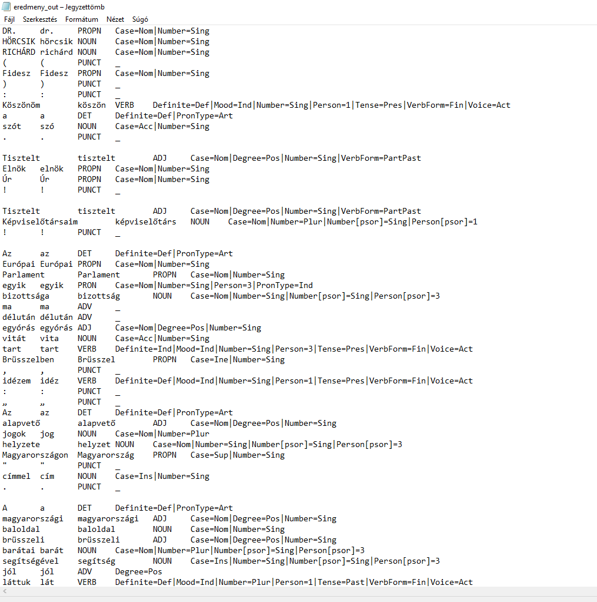
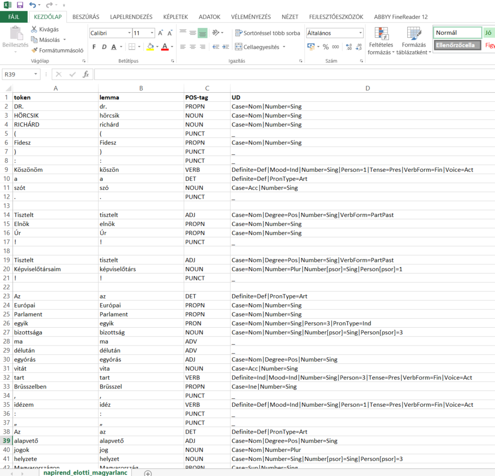
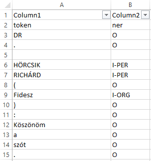

# NLP és névelemfelismerés {#nlp_ch}

A természetes-nyelv feldolgozása (*Natural Language Processing -- NLP*) a nyelvészet és a mesterséges intelligencia közös területe, amely a számítógépes módszerek segítségével elemzi az emberek által használt (természetes) nyelveket. Azaz képes feldolgozni különböző szöveges dokumentumok tartalmát, kinyerni a bennük található információkat, kategorizálni és rendszerezni azokat. 

Angol nyelvű szövegek NLP elemzésére több R csomag is rendelkezésünre áll, ezek közül kettőt mutatunk be röviden. Mivel magyar nyelvű szövegek NLP elemzésére ezek a csomagok jelenleg nem alkalmasak, azt mutatjuk be, hogyan végezhetjük el a magyar nyelvű szövegek mondatra és szavakra bontását, szófaji egyértelműsítését, morfológiai és szintaktikai elemzését az R program használata nélkül és azután a kapott fájlokkal hogyan végezhetünk az R program segítségével további elemzéseket.[^nlp-1]

[^nlp-1]: Magyar nyelvű szövegek NLP elemzésére használható eszközök részletes listája: <https://github.com/oroszgy/awesome-hungarian-nlp>

A fejezetben részletesen foglalkozunk a névelem-felismeréssel (*Named Entity Recognition -- NER*). Névelemnek azokat a tokensorozatokat nevezzük, amelyek valamely entitást egyedi módon jelölnek. A névelem-felismerés az infomációkinyerés részterülete, melynek lényege, hogy automatikusan felismerjük a strukturálátlan szövegben szereplő tulajdonneveket, majd azokat kigyűjtsük, és típusonként (például személynév, földrajzi név, márkanév, stb.) csoportosítsuk. Bár a tulajdonnevek mellett névelemnek tekinthetők még például a telefonszámok vagy az e-mail címek is, a névelem-felismerés leginkább mégis a tulajdonnevek felismerésére irányul. A névelem-felismerés a számítógépes nyelvészetben a korai 1990-es évektől kezdve fontos feladatnak és megoldandó problémának számít.

A névelem-felismerés többféle módon is megoldható, így például felügyelt tanulással, szótár alapú módszerekkel vagy kollokációk elemzésével. A névelem-felismerés körében két alapvető módszer alkalmazására van lehetőség. A szabályalapú módszer alkalmazása során előre megadott adatok alapján kerül kinyerésre az információ (ilyen szabály például a mondatközi nagybetű mint a tulajdonnév kezdete). A másik módszer a statisztikai tanulás, amikor a gép alkot szabályokat a kutató előzetes mintakódolása alapján. A névelemfelismerés során nehézséget okozhat a különböző névelemosztályok közötti gyakori átfedés, így például ha egy adott szó településnév és vezetéknév is lehet.

A magyar nyelvű szövegekben a tulajdonnevek automatikus annotációjára jelenleg három módon van lehetőség: tulajdonnév-felismerő algoritmussal, szófaji címke szintjén történő megkülönböztetéssel, valamint szintaktikai szintű címkézéssel. Utóbbi kettőre példa a fejezetben is bemutatásra kerülő `magyarlanc` elemző, ami szófaji szinten megkülönbözteti a tulajdonneveket, a szintaxis szintjén pedig jelöli a többtagúakat.[@zsibritaMagyarlancToolMorphological2013] 

A tulajdonnév-felismerő algoritmusok megkeresik az adott szövegben a tulajdonneveket, majd azokat valamilyen kategóriába sorolják, ilyen magyar nyelvű algoritmus a `szeged ner`, melynek alkalmazását szintén bemutatjuk.[@szarvasMultilingualNamedEntity2006] Fontos különbséget tenni a névelem-felismerés és a tulajdonnév-felismerés között. A névelem-felismerésbe beletartozik minden olyan kifejezés, amely a világ valamely entitására egyedi módon (unikálisan) referál. Ezzel szemben a tulajdonnév-felismerés, kizárólag a tulajdonnevekre koncentrál.[@uvegesNamedEntityRecognition2019; @vinczeBeszedEsNyelvelemzo2019]

A `magyarlanc`nyelvi előfeldolgozó eszköz a Szegedi Tudományegyetem fejlesztése,[@zsibritaMagyarlancToolMorphological2013] ami magyar nyelvű `txt` formátumú fájlokat feldolgozva képes egy szöveg mondatokra és szavakra bontására, a szavak morfológiai elemzésére, szófaji egyértelműsítésére, emellett kétféle szintaktikai elemzést is képes hozzárendelni a mondatokhoz.[^nlp-2]

[^nlp-2]: A magyarlanc elérhető a [\<https://rgai.inf.u-szeged.hu/magyarlanc\>](https://rgai.inf.u-szeged.hu/magyarlanc){.uri} oldalon, az innen letölthető `jar` fájl segítségével a `txt` formátumú szövegfájlok elemzése parancssorból lehetséges.

A magyarlanchoz hasonlóan az UDPipe nevű elemző szintén képes magyar nyelvű nyers szövegek mondatra és szavakra bontására és szófaji elemzésére, azaz POS-taggelésére (*Part of Speech-tagging*) továbbá a mondatok függőségi elemzésére. Ez az elemző a nemzetközileg elismert Universal Dependencies annotációs sémán alapul. [@strakaTokenizingPosTagging2017] A két nyelvi elemző hasonló funkcionalitásokkal rendelkezik, ugyanakkor az UDPipe technikailag könnyebben kezelhető, azonban kevésbé pontos elemzési eredményt ad, mivel jóval kisebb tanító anyagon lett betanítva, mint a `magyarlanc`.[^nlp-3]

[^nlp-3]: Az UDPipe elérhetősége: <http://lindat.mff.cuni.cz/services/udpipe>

Az alábbiakban a `magyarlanc` és a `szeged ner` működését és az általuk létrehozott fájlokkal R-ben végezhető elemzésekre mutatunk példákat.

## A `magyarlanc`

Az elemző használatának részletes leírás megtalálható a már jelzett honlapon, itt most csak vázlatosan ismeretetjük. Fontos kiemelni, hogy a `magyarlanc` JAVA modulokból áll, így használatához szükséges, hogy a számítógépen megfelelő JAVA környezet legyen telepítve. Először fenti oldalról le kell töltenünk a `magyarlanc-3.0.jar` fájlt, majd bemásolni azt abba a mappába, ahol az elemezni kívánt `txt` található. A parancssort Windows operációs rendszer alatt a számítógép kereső mezőjébe a `cmd` parancs beírásával tudjuk megnyitni. Ezután a parancsorban belépve abba a könyvtárba, ahol az elemezni kíván txt és a `magyarlanc-3.0.jar` elemző van, az alábbi parancs segítségével végezhetjük el az elemzést: `java -Xmx1G -jar magyarlanc-3.0.jar -mode morphparse -input in.txt -output out.txt`, ahol az `in.txt` helyébe az elemezni kívánt `txt` nevét, az `out.txt` helyébe, pedig az elemzés eredményeként létrejövő fájl nevét kell megadni.

Példánkban az Országgyűlésben 2014 és 2018 között elhangzott véletlenszerűen kiválasztott 25 napirend előtti felszólalás korpuszán szemléltetjük az elemző működését.[^nlp4] A 25 fájlt elemezhetjük egyesével, de ha ez a későbbi elemzéshez nem szükséges, a parancsorban a `copy *.txt eredmeny.txt` paranccsal egyesíthetjük azokat egy fájlba. Majd ezen az eredmeny.txt-n végezzük el az elemzést az alábbi paranccsal: `java -Xmx1G -jar magyarlanc-3.0.jar -mode morphparse -input eredmeny.txt -output eredmeny_out.txt`

[^nlp4]: A napirend előtti felszólalásokat tartalmazó korpusz a Hungarian Comparative Agendas Project keretében készült: <https://cap.tk.hu/hu>

Az elemzés eredményéül kapott `txt` fájlban láthatjuk, hogy az elemző elvégezte a szövegek mondatokra bontását, tokenizálását, szótári alakra hozását és POS-taggelését, azaz meghatározta a szavak szófaját.

```{r echo=FALSE, fig.cap="A magyarlánc elemző nyers eredménye"}

```

Ezt követően célszerű a `txt` fájlt excelbe beolvasva oszlopokra tagolni, az oszlopokat fejléccel ellátni, majd `csv` fájlként elmenteni.

```{r echo=FALSE, fig.cap="Az Excelben megnyitott magyarlánc eredmény"}


```

Az így létrehozott `.csv` fájllal megyegyező adattáblát be tudjuk tölteni a `HunMineR` segítségével.

```{r}
library(dplyr)
library(HunMineR)
```

```{r}
napirend_elotti <- HunMineR::data_parlspeech_magyarlanc
```

Az így létrehozott objektummal, mely esetünkben 17870 megfigyelést és 4 változót tartalmaz, ezután különböző műveleteket végezhetünk, a korábban már bemutatottak szerint, például `dplyr` csomag `filter` függvénye segítségével kiválogathatjuk az igéket, és elmenthetjük azokat egy újabb 1769 megfigyelést és 4 változót tartalmazó objektumba.

```{r}
verb_napirend_elotti <- napirend_elotti %>%
  filter(POS_tag == "VERB")
```

## A `szeged ner`

A `magyarlanc` nyelvi elemzőhöz hasonlóan használhatjuk a `szeged ner` elemzőt is, melynek részletes leírása és maga a `ner.jar` elemző is megtalálható az alábbi oldalon: <https://rgai.inf.u-szeged.hu/node/109>. Az elemző a fent bemutatott módon szintén parancssorból indítható az alábbi parancs használatával: `java -Xmx3G -jar ner.jar -mode predicate -input input.txt -output output.txt`. Az elemző PER (személynév), LOC (hely(szín)), ORG (szervezet) és MISC (vegyes) címkét ad az egyes névelemeknek.

```{r echo=FALSE, fig.cap="A szeged ner elemző eredménye"}


```

A fentiekhez hasonlóan ezt a txt-t is átalakíthatjuk táblázattá, majd ezt a `csv` fájlt beolvashatjuk (a `HunMineR` csomag szintén tartalmazza ezt a data frame-et).

```{r}
napirend_elotti_ner <- HunMineR::data_parlspeech_szner
```

Ezután tetszőlegesen kiválogathatjuk például a helyek neveit. A filterezés eredményeként láthatjuk, hogy az elemző korpuszunkban 175 szót azonosított és címkézett fel helynévként.

```{r}
loc_napirend_elotti <- napirend_elotti_ner %>%
  filter(ner == "I-LOC")
```

De ugyanígy kiváogathatjuk a személyneveket is, azonban itt figyelembe kell vennünk, hogy az elemző külön névelemként jelöli a vezeték és keresztneveket, a további elemzés szükségletei szerint ezeket utólag kell összevonnunk.

```{r}
pers_napirend_elotti <- napirend_elotti_ner %>%
  filter(ner == "I-PER")
```

Az így kiválogatott különböző névelemekkel azután további elemzéseket végezhetünk.

## Angol nyelvű szövegek névelemfelismerése

Amennyiben angol nyelvű korpusszal dolgozunk több lehetőség is a rendelkezésünkre áll a névelemfelismerés elvégzésére.[^nlp5] Ezek közül most röviden a `spacyr` használatát mutatjuk be.[^nlp6] A `spaCy` nem egy `R`, hanem egy `Phyton` csomag[^nlp7], amely azonban az R `reticulate` csomag segítségével nagyon jól együttműködik a kötetben rendszeresen használt `quanteda` csomaggal. Használatához a már megszokott módon installálnunk kell a spacyr csomagot, majd beolvasnunk és telepítenünk az angol nyelvi modellt. A Pythonban készült `spacy`-t a `spacyr::spacy_install()` paranccsal kell telepíteni (ezt elég egyszer megtenni, amikor először használjuk a csomagot).

[^nlp5]: További lehetőségekhez lásd például: <https://analyticsindiamag.com/top-10-r-packages-for-natural-language-processing-nlp/>

[^nlp6]: Részletes leírása: <https://spacyr.quanteda.io/articles/using_spacyr.html>

[^nlp7]: Részletes leírása: <https://spacy.io/usage/linguistic-features#named-entities>

```{r}
library(spacyr)
library(quanteda)
library(ggplot2)

spacy_initialize(model = "en_core_web_sm")
```

A `spacy_parse()` függvény segítségével lehetőségünk van a szövegek tokenizálására, szótári alakra hozására és szófaji egyértelműsítésére.

```{r}
txt <- c(d1 = "spaCy is great at fast natural language processing.",
         d2 = "Mr. Smith spent two years in North Carolina.")

# process documents and obtain a data.table
parsedtxt <- spacy_parse(txt)

parsedtxt
```

Az elvégzett tokenizálás eredményéből adattáblát készíthetünk.

```{r}
spacy_tokenize(txt, remove_punct = TRUE, output = "data.frame") %>%
    tail()
```

Ugyancsak lehetőségünk van a különböző entitások, így például a tulajdonnevek kinyerésére.

```{r}
parsedtxt <- spacy_parse(txt, lemma = FALSE, entity = TRUE, nounphrase = TRUE)
entity_extract(parsedtxt)
```

A tulajdonneveken túl felcímkézhetjük a dátumokat, eseményeket is.

```{r}
entity_extract(parsedtxt, type = "all")
```

Az `entity_consolidate()` függvény segítségével arra is lehetőségünk van, hogy a több szóból álló entitásokat egy tokenként kezeljük.

```{r}
entity_consolidate(parsedtxt) %>%
    tail()
```

A `nounphrase_extract()` függvény lehetőséget ad az összetartozó kifejezések összefűzésére.

```{r}
nounphrase_extract(parsedtxt)
```

Majd képes arra, hogy ezeket az összetartozó kifejezéseket egyben kezelje.

```{r}
nounphrase_consolidate(parsedtxt)
```

Arra is lehetőség van, hogy az egyes kifejezések közötti függőségeket vizsgáljuk.

```{r}
spacy_parse(txt, dependency = TRUE, lemma = FALSE, pos = FALSE)
```

A következőkben a [Szótáralapú elemzések, érzelem-elemzés](#sentiment) fejezetben is használt Magyar Nemzeti Bank kamatdöntéseit kísérő nemzetközi sajtóközleményei korpuszán mutatunk be egy példát a névelemfelismerésre és az eredmények vizualizálására.

Első lépésként beolvassuk a szövegeket, majd a már megismert `quanteda` csomag segítségévek korpuszt készítünk belőlük.

```{r}
mnb_df <- HunMineR::data_mnb_pr

corpus_mnb <-corpus(mnb_df)
```

Ezután a `spacy_extract_entity()` függvénye segítségévek elvégezzük a névelemfelismerést, a függvény argumentumában megadva, hogy milyen tipusú névelemeket szeretnénk kigyűjteni a korpuszból. A lehetséges típusok a *named*, *extended*, vagy *all*.[^nlp8] Az elemzés eredménye pedig készülhet listában, vagy készülhet belőle adattábla. Példánkban mi kimenetként listát állítottunk be.

[^nlp8]: Részletes leírását lásd: <https://towardsdatascience.com/extend-named-entity-recogniser-ner-to-label-new-entities-with-spacy-339ee5979044>

A névelemek tokenjeit ezután megritkítottuk, és csak azokat hagytuk meg, amelyek legalább nyolc alkalommal szerepeltek a korpuszban.

```{r}
mnb_ner <- spacy_extract_entity(
  corpus_mnb,
  output = c("list"),
  type = ("named"),
  multithread = TRUE)

mnb_tokens <- tokens(mnb_ner)

features <- dfm(mnb_tokens) %>%
  dfm_trim(min_termfreq = 8) %>%
  featnames()

mnb_tokens <- tokens_select(mnb_tokens, features, padding = TRUE)
```

Ezután a különböző alakban előforduló, de ugyanarra az entitásra vonatkozó névelemeket összevontuk.

```{r}
mnb <- c("Magyar Nemzeti Bank", "MAGYAR NEMZETI BANK", "The Magyar Nemzeti Bank ", "the Magyar Nemzeti Bank", "MNB", "the Magyar Nemzeti Banks", "Nemzeti Bank", "The Magyar Nemzeti Banks MNB" )
lemma <- rep("Magyar Nemzeti Bank", length(mnb))
mnb_tokens <- tokens_replace(mnb_tokens, mnb, lemma, valuetype = "fixed")

mc <- c("Monetary Council", "MONETARY COUNCIL", "Magyar Nemzeti Bank Monetary Council", "MAGYAR NEMZETI BANK Monetary Council", "NEMZETI BANK Monetary Council" ,"The Monetary Council", "Council", "The Council", "Councils", "the Monetary Council", "Monetary Councils", "the Monetary Councils", "The Monetary Councils", "Monetray Council", "May the Monetary Council")
lemma <- rep("Monetary Council", length(mc))
mnb_tokens <- tokens_replace(mnb_tokens, mc, lemma, valuetype = "fixed")
```

Majd elkészítettük a szóbeágyazás fejezetben már megismert fcm-et, végezetül pedig egy együttes előfordulási mátrixot készítettünk a kinyert entitásokból és a ggplot segítségével ábrázoltuk.[^nlp9]

[^nlp9]: Részletes leírását lásd: <https://tutorials.quanteda.io/basic-operations/fcm/fcm/>

```{r fig.cap="A Magyar Nemzeti Bank korpusz névelemeinek együttelőfordulási mátrixa"}
mnb_fcm <- fcm(mnb_tokens, context = "window", count = "weighted", weights = 1 / (1:5), tri = TRUE)

feat <- names(topfeatures(mnb_fcm, 80))
mnb_fcm_select <- fcm_select(mnb_fcm, pattern = feat, selection = "keep")
dim(mnb_fcm_select)

size <- log(colSums(dfm_select(mnb_fcm, feat, selection = "keep")))

set.seed(144)

textplot_network(mnb_fcm_select, min_freq = 0.7, vertex_size = size / max(size) * 3)
```

A spacyr alapvetően az angol nyelvi modellel működik, de arra is van lehetőség, hogy a spaCy egyéb beépített nyelvi modelljeit (német, spanyol, portugál) használjuk. Létezik magyar nyelvi modell is, ez azonban jelenleg még nincs integrálva a spaCy-be, hanem egy GitHub repozitoriumból tölthető le. Ennek R-ben történő megvalósításához azonban haladó R ismeretek szükségesek, azért ennek leírásától jelen kötetben eltekintünk. A magyar nyelvi modell és leírása elérhető az alábbi linken: <https://github.com/oroszgy/spacy-hungarian-models>
